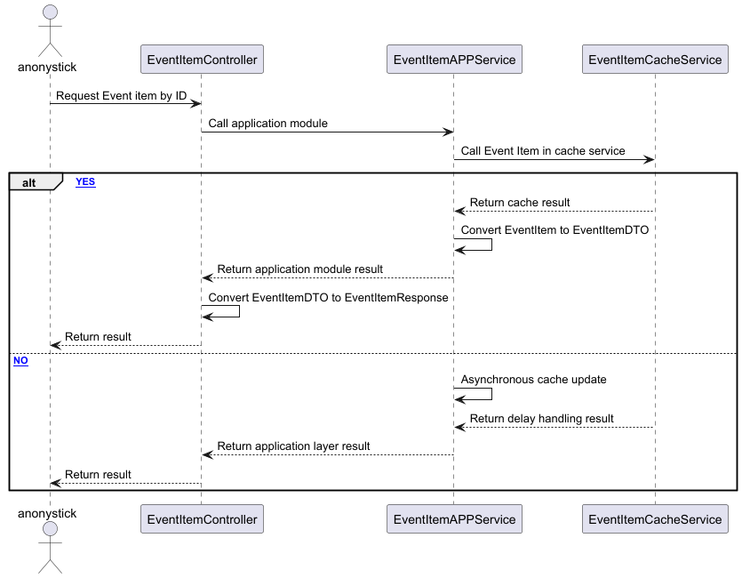

# Dự án bán vé tàu tết

Dự án này nhằm mục đích xây dựng một hệ thống bán vé tàu tết trực tuyến, giúp người dùng dễ dàng đặt vé và quản lý thông tin chuyến đi trong dịp tết.

## Domain
- event : sự kiện tàu tết 
- order: đơn hàng

## flow event

## Handle request
Example:

- tomcat : max 10 thread, jmeter : 100 thread
=> After 10 request, the rest will be waited for too long or may be missed (DDOS)

solutions: hystrix, sentinel, resilience4j
GUARD:
- graceful degradation
- usage throttling
- Adaptive Backpressure (auto-adjust to demand) 
- Resource shift loading
- Dynamic circuit Breaker

## How to test
- Jmeter
  https://youtu.be/IcDiMkb7_TA?si=TRNu7ErBN48UpKQa&t=1293